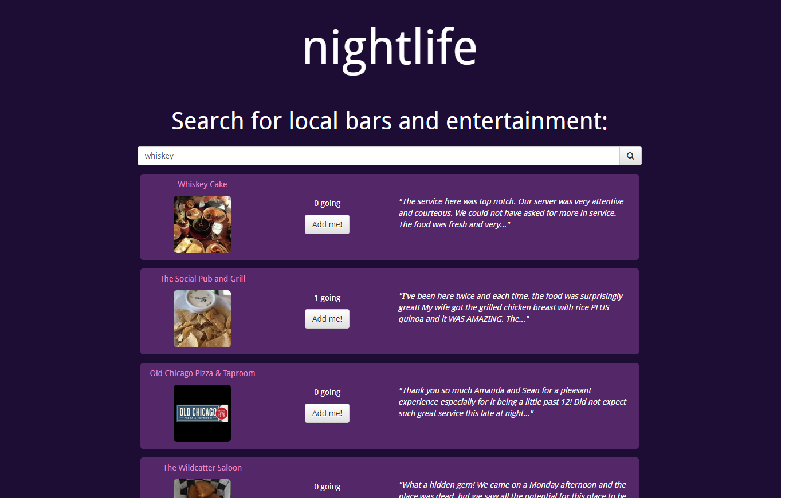

# [nightlife](https://night-life-djmot.herokuapp.com/)

## Local entertainment coordination app

This Node.js web app enables users to search for local entertainment and see where other users are going. It uses [Yelp Fusion v3 API](https://www.yelp.com/developers/documentation/v3) to search for local businesses and [Twitter API](https://developer.twitter.com/en/docs) for authentication, backed by a MongoDB database.

## Deploy

This website is deployed to Heroku and can be viewed [here.](https://night-life-djmot.herokuapp.com/) To deploy changes, just push new code to this repo.
